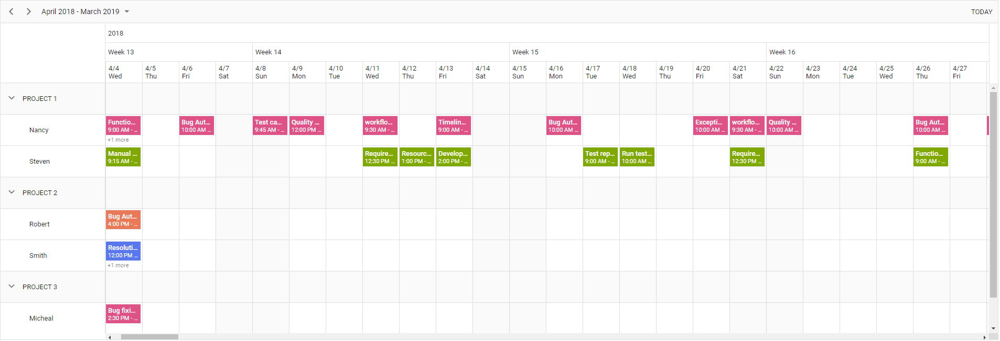

# Syncfusion Angular 8 Scheduler Header Rows With Resources

This project helps you to add header rows along with resource.



## Scheduler features covered in this Project

The Scheduler features included in this project are as follows.
* Drag and resize actions enabled for events by default.
* Setting current date and view for scheduler.
* `resources` to render the different resource in Scheduler.
* Header rows for render the expected header in the resource project.
* Date header template used to customize the date header rows.

## How to run this application?
To run this application, clone the `ej2-angular-scheduler-header-rows-with-resources` repository and then navigate to its appropriate path where it has been located in your system.

## Installing
Once done with downloading, install the necessary packages required to run this application locally. The `npm install` command will install all the necessary angular packages into your current project. Run the below command to do so.

```
npm install
```
## Running on development server
Run `ng serve` for a dev server. Navigate to `http://localhost:4200/`. The app will automatically reload if you change any of the source files.

## Further help

To get more help on the Angular CLI use `ng help` or go check out the [Angular CLI README](https://github.com/angular/angular-cli/blob/master/README.md).
